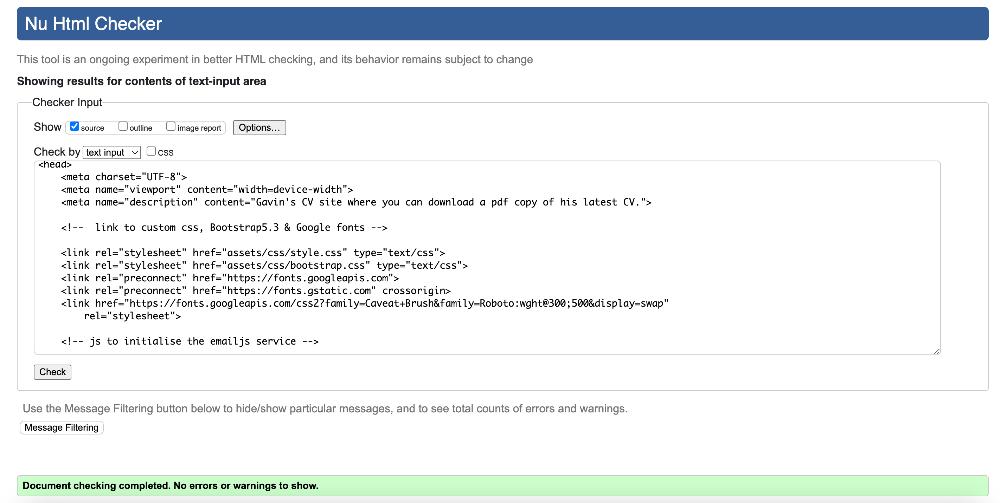
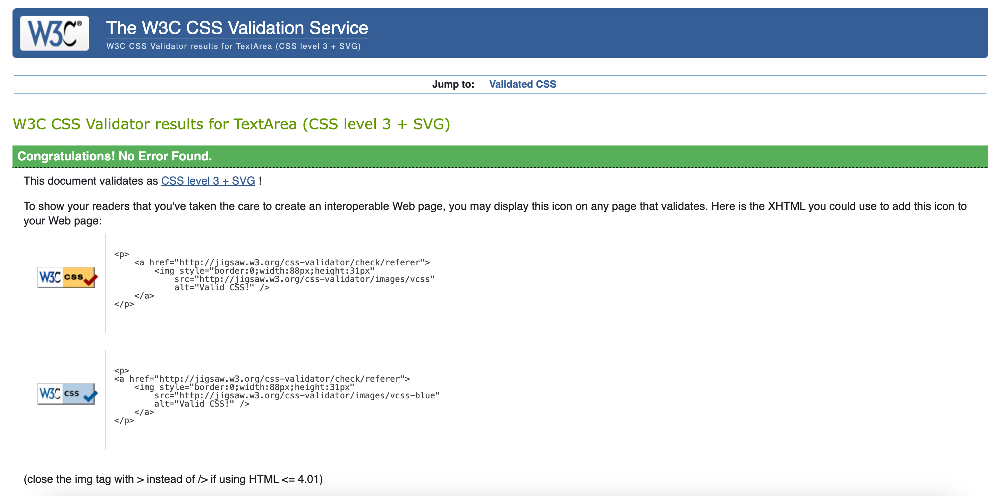
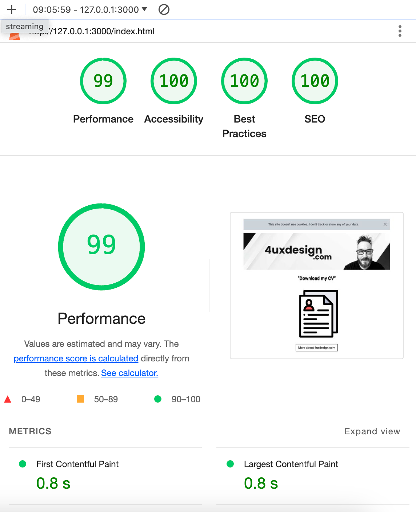

# 4uxdesign.com Website & CV

A single page site for my business '4uxdesign' including a a portfolio page and about me modal.

## Technologies

- HTML5
- [Bootstrap5.3](https://getbootstrap.com/) - CSS/Javascript library.
- [Email JS](https://www.emailjs.com/) - send email using Javascript.

## Testing

Browsers tested, Chrome Version 123.0.6312.87 (Official Build) (arm64),
Safari on iPhone 14 iOS Version 17.4.1 and Google Dev Tools.

- W3C HTML Checker

- W3C CSS Validator

- Google Lighthouse

- [amiresponive.com](https://ui.dev/amiresponsive?url=https://www.4uxdesign.com/) - checks responsiveness of site.

## Author

Gavin Brown
[Linkedin Profile](https://www.linkedin.com/in/gavinwbrown/)

e: gavin.brown@4uxdesign.com

m: 07423463521

## Version History

Available here on Github.

## Acknowledgments

- [Nikita Kachanovsky on Unsplash](https://unsplash.com/@nkachanovskyyy) - Fantastic main image used for site. Check them out on Unsplash
- [CV icon created by Freepik - Flaticon](https://www.flaticon.com/free-icons/profile) - Awesome icons for free. Check them out!
- [Favicon Creator](https://favicon.io/)
- [Compressnow](https://compressnow.com/) - image compression.
- [Convertio](https://convertio.co/) - convert images to webp format.
- [Stackoverflow](https://stackoverflow.com/) - a great resource for coding questions and answers.
- [Codedamn](https://codedamn.com/news/html/how-to-create-flashing-blinking-text-using-html) - css blinking code.
